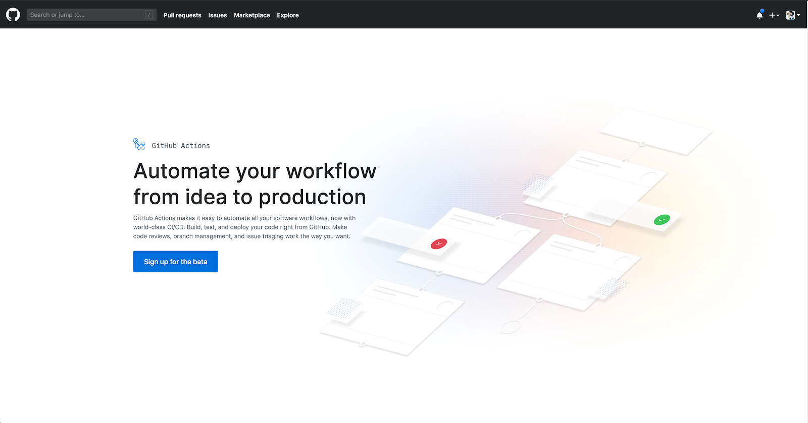
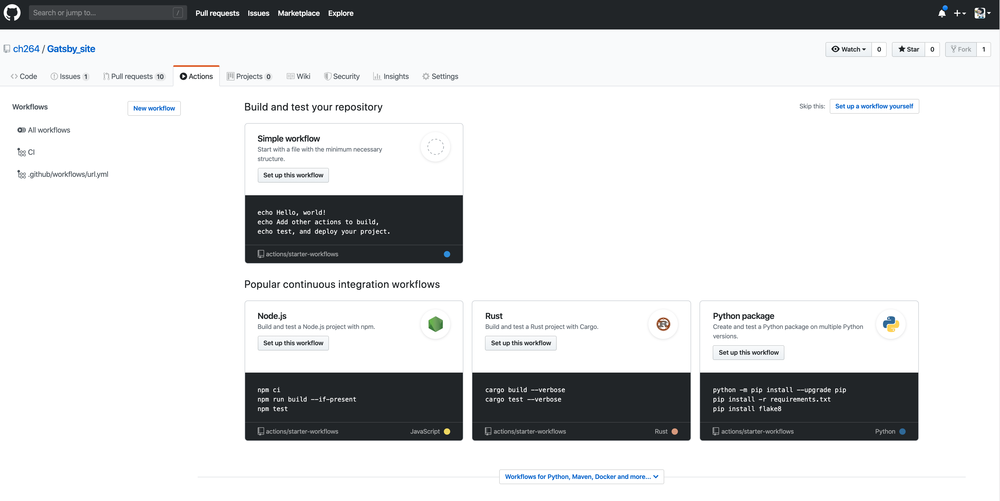
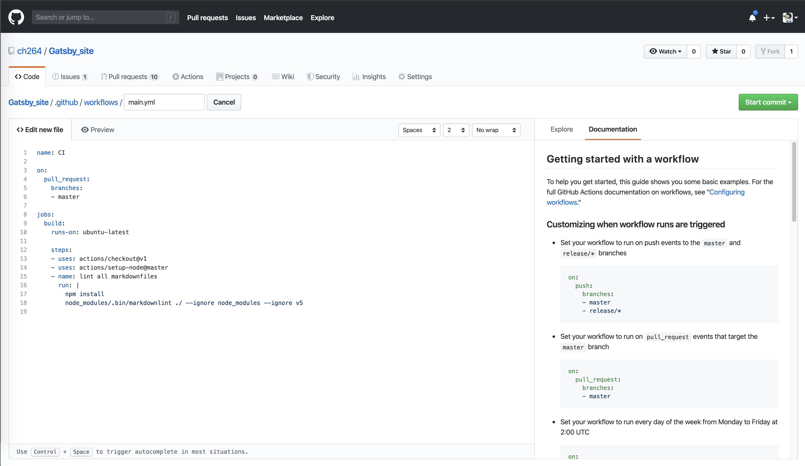
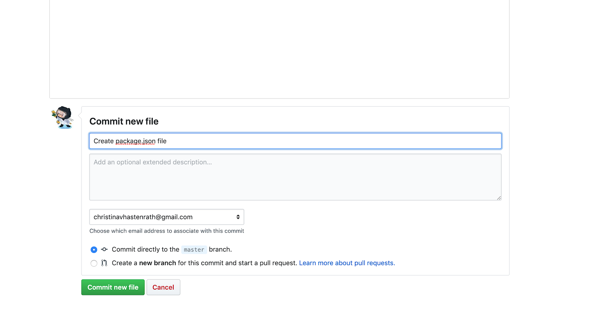

This is a tutorial to show you how I set up GitHub Actions for Markdown linting with David Ansons’s Markdownlint library.
Co-authored by Matt Ball

## What is a Markdown linter?

Markdown is the Markup language that our docs are written in. A Markdown linter is a library of rules that standardize how Markdown files are written and merged into your codebase. This ensures that the codebase is standardized and readable for the rest of the community. My Markdown linter is configured to run on a pull-request and checks that the code in the pull-request matches my Markdown Language quality settings. Once the linter finishes, it will give a status update of “fail” or “pass”. Having a linter in place increases code quality and pages being rendered the way they are supposed to.

## Why GitHub Actions CI Tool?
The biggest plus for implementing GitHub actions was the removal of another third party tool and offering a completely free plan for open source projects. GitHub Actions can be run on Linux, macOS, Windows and containers, or run directly in a VM. It helps me add custom workflows directly in my GitHub Repo.

## How we setup GitHub Actions CI Tool for Markdown linting
1. Sign up the to GitHub Actions Beta



2. Go to the “Actions” tab and select: “set up workflow yourself”



3. Create a .yml file with the name, when the linter should run and the actual command to run the linter. GitHub provides excellent Documentation on the side to support the setting up of your yml file.
I have set my linter to run on pull_request but you can also set it to push.



4. If your project does not have package.json file yet, create a package.json file with an empty curly braces in order to store your linter as a dependency.



5. We want to glob our files when running the Markdown linter so we use Markdownlint-cli, which uses the Markdownlint library by DavidAnson. Run the following command to create a dependency in your package.json.

```bash
$ npm install markdownlint-cli
```

6. Create a .markdownlint.yml file and pass in your configuration settings. Here is a starter code for your settings:

```JSON
{
  "default": true,
  "MD003": { "style": "atx_closed" },
  "MD007": { "indent": 4 },
  "no-hard-tabs": false,
  "whitespace": false
}
```

## Run the linter locally
In order to run the Markdown linter locally, clone down the repo and run
$ npm install
$ node_modules/.bin/markdownlint ./ --ignore node_modules
Run the linter on a branch’s modified files
If you would like to run the linter only on the branch that you would like to merge you can add the following code to your GitHub Actions workflow file

```bash
...

jobs:
 build:
  runs-on: ubuntu-latest
  steps:

  - uses: actions/checkout@v1
    with:
      ref: ${{ github.head_ref }}

  - uses: actions/setup-node@master
  - name: lint all markdownfiles
    run: |
      npm install
      node_modules/.bin/markdownlint ./ --ignore node_modules
```

You will also have to create a bash script mdlint.sh

```bash
#!/bin/bash

files=`(git fetch origin master:master) && (git diff --name-only master)`

for x in $files;
do
if [ ${x: -3} == ".md" ]
then
node_modules/.bin/markdownlint $x
fi
done
```

You can call the script by adding it in you package.json

```json
"scripts": {
    "test": "bash mdlint.sh"
  }
```
---

Congratulations! Your Github Actions CI Tool with Markdownlinting has now been successfully setup. You can watch the linter run when pushing code or creating a pull-request to the branch you set in your workflow file.