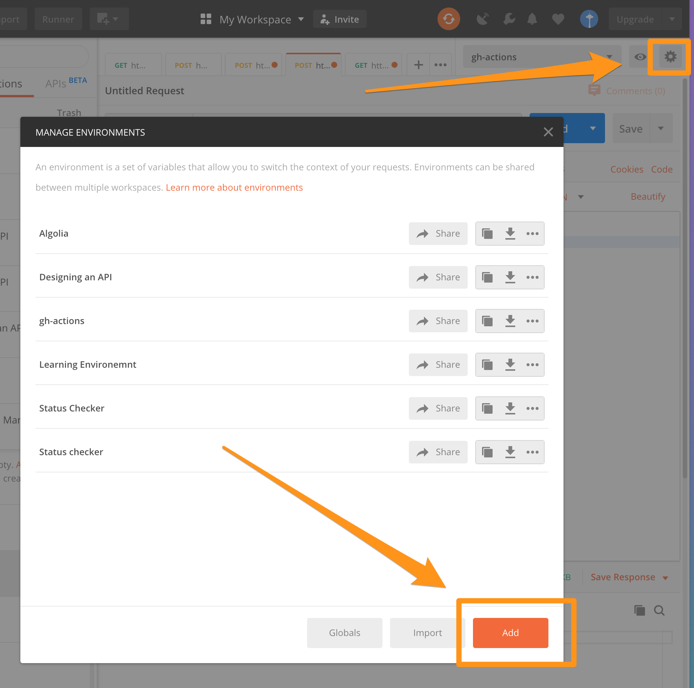
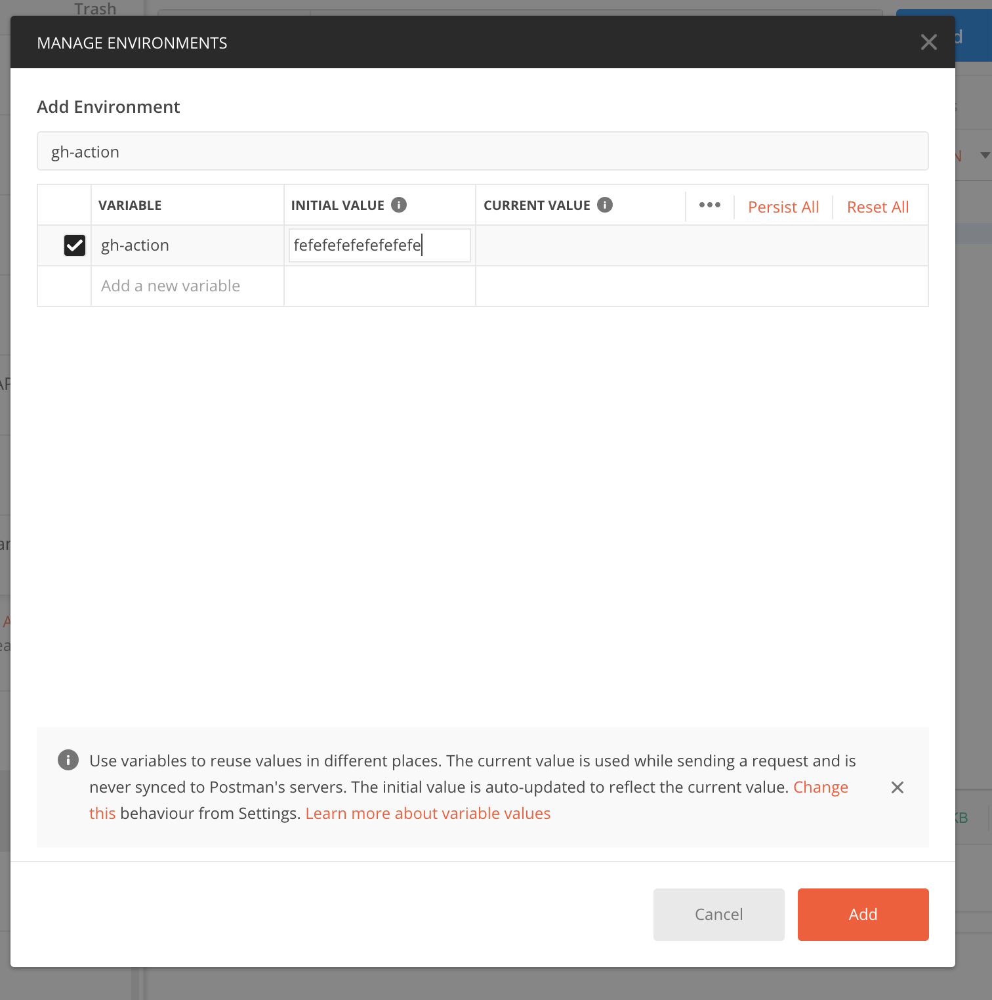
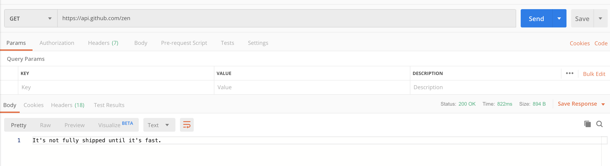
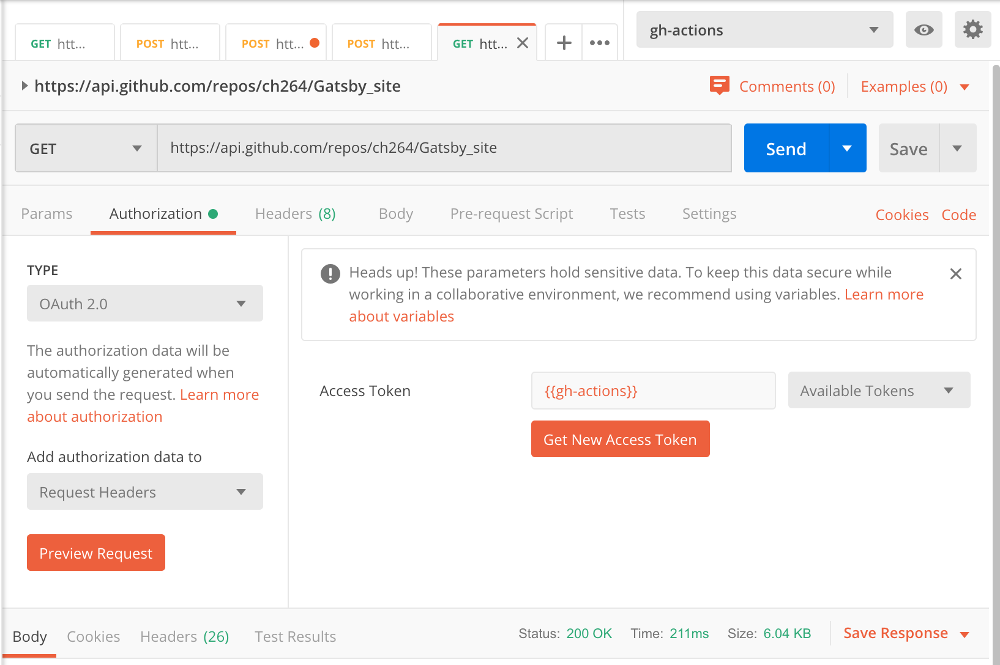
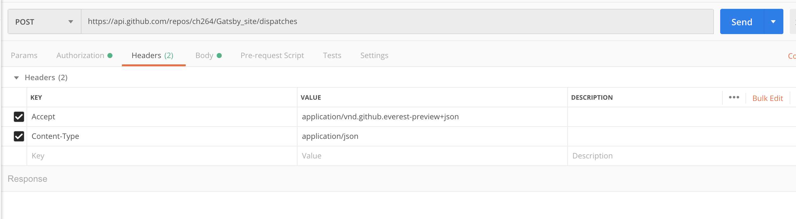
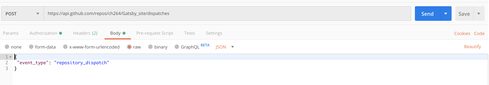
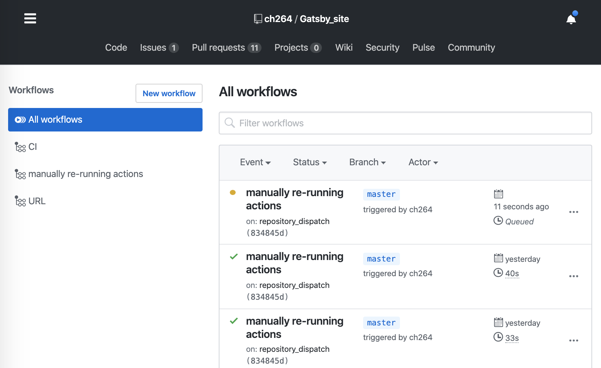

This is a tutorial to show you how I setup a manual trigger for a GitHub actions workflow with Postman.


Github recently published a UI button to re-run a GitHub Actions workflow file when tests fails. In order to run a GitHub Actions workflow manually I used the GitHub API [repository_dispatch](https://help.github.com/en/actions/automating-your-workflow-with-github-actions/events-that-trigger-workflows) event to trigger a workflow rerun via Postman.

## GitHub Action workflow file

First, I had to setup a new workflow file in myGitHub Action Workflow, which listens for the repository dispatch event:

```bash
name: manually re-running actions

on: repository_dispatch

jobs:
  manual_deploy:
    runs-on: ubuntu-latest
    steps:
    - name: Checkout master
      uses: actions/checkout@v1
      with:
        ref: master
 ...
 ```

## GitHub Access Token

If you have 2FA setup for your GitHub Account, like me, you have to generate a [personal access token](https://help.github.com/en/github/authenticating-to-github/creating-a-personal-access-token-for-the-command-line) in GitHub in order to send an event to the GitHub API for Authentication. You can do so in your profile settings / Developer Settings / Personal Access Token. If you would like to authenticate yourself differently, here is a link to the [GitHub docs for authentication](https://developer.github.com/v3/auth/).

I will continue this tutorial with a personal access token.

## Create a repository dispatch event in Postman

Now that we have created our personal access token, we can open our Postman account and save our token in our environment variables.



Give your environment a name and add the Variable name and Value (your GitHub Access Token).



Save it and now you can call your variable in your Post Request, which we are going to setup in the steps below.

## Testing your GitHub API Connection
You can test your Github API Connections by running a Get request in Postman hitting this endpoint:

```bash
https://api.github.com/zen
```

It will bring back a random quote.


## Setting up the real deal
Now we can set the environment variables and include the access token as a [variable](https://learning.getpostman.com/docs/postman/environments-and-globals/variables/) in order to authorize ourselves.


We then have to include an Accept header with the value:

```json
application/vnd.github.everest-preview+json
```

You can find more information on the header in the GitHub API docs.


The last step is to include the actual body you are sending to the API. In this case we are sending the event: repository_dispatch like so:


## Et voilà!
Hit send and you will see your GitHub Action kicking off in your repo.


---

Congratulations! Your manual button to trigger your GitHub Actions workflow has successfully been setup. If you would like to run your Post Request in the command line, you can download [Newman, the Postman Command Line tool](https://learning.getpostman.com/docs/postman/collection-runs/command-line-integration-with-newman/) or you can setup a [monitor in Postman](https://learning.getpostman.com/docs/postman/monitors/setting-up-monitor/) to schedule a run of your new collection.